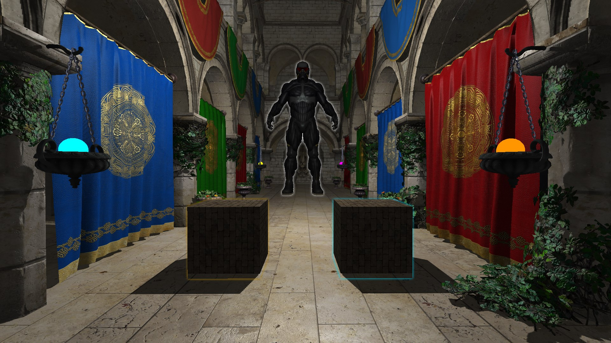

# DirectX 11 Graphics Engine

A graphics engine created using DirectX 11 that implements a number of advanced C++ programming techniques. 
*Created according to <a href="https://planetchili.net/">PlanetChili</a>'s DirectX Programming Tutorials*

*Click image to view on YouTube*

---

### Credits
        
        Source Code:
                    https://planetchili.net/
                    https://github.com/planetchili/hw3d
                    
        Audio:
                    From The Dust - Supernova: https://youtu.be/H3cPiYfwuo8
